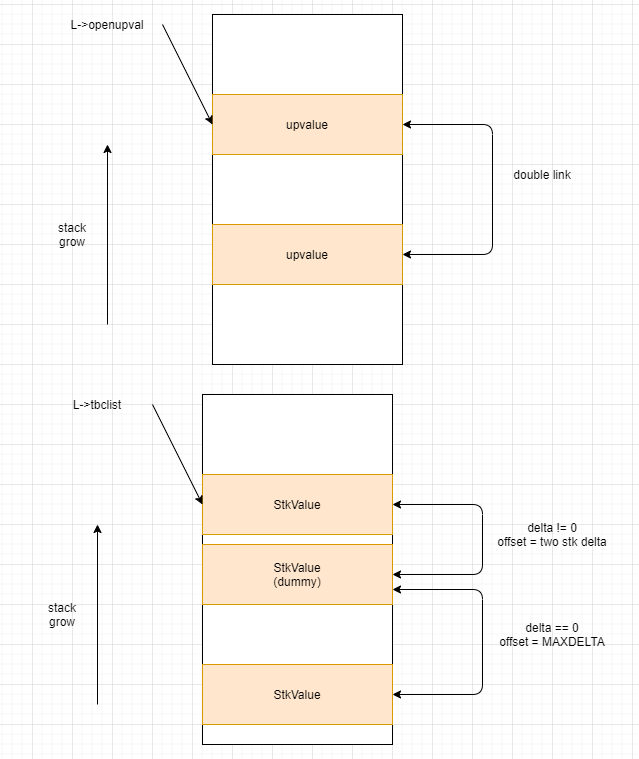

# Prototypes / Closures

## 要点
1. Upvalue，缩写upval，用来实现闭包，类似C++的lambda捕获。  

                local upval = 1
                local upval2 = 2
                function test()
                        local locvar = 3
                        print(upval)

                        local function aaa()
                                print(upval+upval2+locvar)
                        end
                        aaa()
                end

      上面代码块中，test闭包函数中的Upvalue为upval，aaa闭包函数中的Upvalue为upval, upval2和locvar。  
      closed upvalue和open upvalue： closed意思是当前使用的upvalue被释放掉了之后，需要自己拷贝并持有它。如三层的闭包引用了第二层闭包的某个Value的upvalue，当第二层闭包结束时，该upvalue就变成了一个closed upvalue，此时该upvalue会重新赋值持有这个Value。  
2. Closure

3. StkId是一个指针，指向某个栈值，StkId的大小比较，既可以判断在栈里面的相对关系。>=则表示更接近top。

## 数据结构

---
Prototypes: 

                /*
                ** Description of an upvalue for function prototypes
                */
                typedef struct Upvaldesc {
                        TString *name;  /* upvalue name (for debug information) */
                        lu_byte instack;  /* whether it is in stack (register) */
                        lu_byte idx;  /* index of upvalue (in stack or in outer function's list) */
                        lu_byte kind;  /* kind of corresponding variable */
                } Upvaldesc;

                /*
                ** Description of a local variable for function prototypes
                ** (used for debug information)
                */
                typedef struct LocVar {
                        TString *varname;
                        int startpc;  /* first point where variable is active */
                        int endpc;    /* first point where variable is dead */
                } LocVar;

                /*
                ** Associates the absolute line source for a given instruction ('pc').
                ** The array 'lineinfo' gives, for each instruction, the difference in
                ** lines from the previous instruction. When that difference does not
                ** fit into a byte, Lua saves the absolute line for that instruction.
                ** (Lua also saves the absolute line periodically, to speed up the
                ** computation of a line number: we can use binary search in the
                ** absolute-line array, but we must traverse the 'lineinfo' array
                ** linearly to compute a line.)
                */
                typedef struct AbsLineInfo {
                        int pc;
                        int line;
                } AbsLineInfo;

                /*
                ** Function Prototypes
                */
                typedef struct Proto {
                        CommonHeader;
                        lu_byte numparams;  /* number of fixed (named) parameters */
                        lu_byte is_vararg;
                        lu_byte maxstacksize;  /* number of registers needed by this function */
                        int sizeupvalues;  /* size of 'upvalues' */
                        int sizek;  /* size of 'k' */
                        int sizecode;
                        int sizelineinfo;
                        int sizep;  /* size of 'p' */
                        int sizelocvars;
                        int sizeabslineinfo;  /* size of 'abslineinfo' */
                        int linedefined;  /* debug information  */
                        int lastlinedefined;  /* debug information  */
                        TValue *k;  /* constants used by the function */
                        Instruction *code;  /* opcodes */
                        struct Proto **p;  /* functions defined inside the function */
                        Upvaldesc *upvalues;  /* upvalue information */
                        ls_byte *lineinfo;  /* information about source lines (debug information) */
                        AbsLineInfo *abslineinfo;  /* idem */
                        LocVar *locvars;  /* information about local variables (debug information) */
                        TString  *source;  /* used for debug information */
                        GCObject *gclist;
                } Proto;
---
Functions:

                /*
                ** Upvalues for Lua closures
                */
                typedef struct UpVal {
                        CommonHeader;
                        lu_byte tbc;  /* true if it represents a to-be-closed variable */
                        TValue *v;  /* points to stack or to its own value */
                        union {
                                struct {  /* (when open) */
                                        struct UpVal *next;  /* linked list */
                                        struct UpVal **previous;
                                } open;
                                TValue value;  /* the value (when closed) */
                        } u;
                } UpVal;

                #define ClosureHeader \
                        CommonHeader; lu_byte nupvalues; GCObject *gclist

                typedef struct CClosure {
                        ClosureHeader;
                        lua_CFunction f;
                        TValue upvalue[1];  /* list of upvalues */
                } CClosure;

                typedef struct LClosure {
                        ClosureHeader;
                        struct Proto *p;
                        UpVal *upvals[1];  /* list of upvalues */
                } LClosure;

                typedef union Closure {
                        CClosure c;
                        LClosure l;
                } Closure;

## ltable.c

| 名称 | 功能 | 参数 | tips |
|:--|:--|:--| :-- |
|luaF_newCclosure|创建一个CClosure C的closure|lua_State *L, int nupvals|luaC_newobj， cast to CClosure，init upvalues number|
|luaF_newLclosure|创建一个LClosure Lua的closure|lua_State *L, int nupvals|uaC_newobj， cast to CClosure，init upvalues number and upvals to null, init proto to null|
|luaF_initupvals|fill a closure with new closed upvalues|lua_State *L, LClosure *cl|根据cl里的nupvalues个数，new同样个数的UpVal对象并初始化value为nil，置为close状态，luaC_objbarrier一下（详见GC部分）|
|static newupval||||
|luaF_findupval|在|||
|callclosemethod|调用obj对象的close函数|lua_State *L, TValue *obj, TValue *err, int isyield|调用luaT_gettmbyobj根据TM_CLOSE的tag到obj找到对应的函数，设置到L的top，调用luaD_call/luaD_callnoyield执行栈顶函数|
|checkclosemth|check close methrod，检查一个对象是否有close tagged method|lua_State *L, StkId level|obj是s2v(level)，找不到则lugG_runerror报错|
|prepcallclosemth|prepare and call a closing method|lua_State *L, StkId level, int status, int isyield|调用closemethod前的准备处理，判断并设置errobj来接收callclosemethod的err值|
|luaF_newtbcupval|tbc stand for to-be-closed. 新插一个tbc value|lua_State *L, StkId level||
|luaF_unlinkupval|解除指定upval的链接关系|UpVal *uv|1. 必须是open的upval 2. 更新previous和next指针即可解|
|luaF_closeupval|遍历指定StkId后面的openupval，将其从链中解除|lua_State *L, StkId level|L->openupval是upvalues链表，存储了所有的upval，越靠前的是最近的栈的upval|
|poptbclist|将tbc list里的最后一个value从list pop掉|lua_State *L|会跳过dummy的节点，delta==0的节点就是dummy，此时需要offset一下-MAXDELTA|
|luaF_close|Close all upvalues and to-be-closed variables up to the given stack level.|lua_State *L, StkId level, int status, int isyield|1. 将upvalues从open变为close 2. pop所有的tbc，并调用其close method|
|luaF_newproto|创建一个proto|lua_State *L|luaC_newobj，cast to Proto，init variables|
|luaF_freeproto|释放一个proto|lua_State *L, Proto *f|free memorys related to Proto *f|
|luaF_getlocalname|返回指定位置的localvar的名称|const Proto *f, int local_number, int pc||

---

 

 

图2.1 function相关结构理解图 

## 思考

- 1. lua stack构建方式，增长方向
- 2. lua state 和 stack的关系
- 3. upval的组织方式，tbc list的作用和效果
  