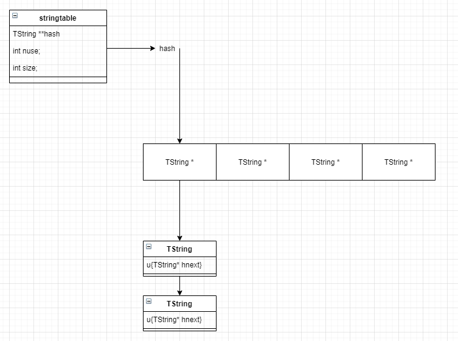

# TString

## 要点
1. string 分short string和long string（40个字符长度为界），short string存放在全局的string table中，string table动态grow或shrink，grow发生在new一个string的时候，shrink会发生在每次checkSizes（lgc.c）的时候。以2的幂次大小做缩放，每次resize会触发rehash，调整每个TString的位置，对于同一个链表里的节点，会反转一次（根据这个特性或许会有优化空间？）  
2. 只有short string在加入string table的时候必定会做一次hash，用于存放如对应的string table的链；对于long string则只有在table中hash table里的算key的时候。  
3. string table的结构形式，最小的string table大小为128  
4. string cache是一个二维数组，每列是一个FIFO的cache，5.4.4中大小为2，其行的索引使用地址做hash，目前大小为53，使用g->memerrmsg固定TString初始化和clear，该TString在g->fixedgc列表中，不会被自动gc。

## 数据结构
                #define CommonHeader	struct GCObject *next; lu_byte tt; lu_byte marked

                typedef struct TString {
                        CommonHeader;
                        lu_byte extra;  /* reserved words for short strings; "has hash" for longs */
                        lu_byte shrlen;  /* length for short strings */
                        unsigned int hash;
                        union {
                        size_t lnglen;  /* length for long strings */
                        struct TString *hnext;  /* linked list for hash table */
                        } u;
                        char contents[1];
                } TString;

                typedef struct stringtable {
                        TString **hash;
                        int nuse;  /* number of elements */
                        int size;
                } stringtable;

                typedef struct global_State{
                    ...
                    TString *memerrmsg;  /* message for memory-allocation errors */
                    TString *strcache[STRCACHE_N][STRCACHE_M];  /* cache for strings in API */
                    ...
                }

## lstring.c

| 名称 | 功能 | 参数 | tips |
|:--|:--|:--| :-- |
| luaS_eqlngstr | 比较两个长字符串是否相等 | TString *a, TString *b | 比较指针是否相等，比较两个字符串的长度和内存内容（memcmp)是否相等 |
|luaS_hash| 计算一个str的hash | const char *str, size_t len, unsigned int seed | 使用异或的方式：seed ^ len ^ 对于每个字符做偏移(<<, >>)和异或 |
|luaS_hashlongstr|计算long string的hash|TString *ts| ts->extra用于标记long string是否计算过hash，对于short string则尚未使用 |
|luaS_resize|重新调整string table大小（增长or缩减shrink）|lua_State *L, int nsize|1. string table保存在global_State->strt中 2. 内存分配失败则保持当前大小 |
|static tablerehash|string table resize辅助函数，根据hash值重新调整table|TString **vect, int origin_size, int new_size| string table的结构就是见图2.1，rehash会反转string链表 |
|luaS_clearcache|清空string cache(cache for strings in API)，strcache存在globale_state中|global_State *g|遍历二维数组strcache，如果是white(will be collected)则置为g->memerrmsg 一个固定的不会被回收的TString|
|luaS_init|初始化string table和string cache|lua_State *L|1. 最小的string table size=128 2. 创建g->memerrmsg(not enough memory)并通过luaC_fix设置为不被gc的对象 3. 初始化二维数组string cache（53 * 2）值为g->memerrmsg|
|static createstrobj|创建一个TString对象|lua_State *L, size_t l, int tag, unsigned int h|1. 计算TString所需大小 2. luaC_newobj根据大小和类型返回一个加入GC队列的GCObject 3. cast to TString并初始化后返回|
|luaS_createlngstrobj|创建一个长字符串|lua_State *L, size_t l|createstrobj后额外设置u.lnglen|
|luaS_remove|将指定字符串从strint table中移除|lua_State *L, TString *ts|根据hash找到指定链表，遍历链表移除ts|
|static growstrtab|尝试增长string table|lua_State *L, stringtable *tb|1. tb->nuse太多时，尝试gc，无果报错； 2. 当tb->size <= MAXSTRTB / 2时，调用luaS_resize增长2 * size; 3. MAXSTRTB意思是max size of string table，值为MAX_SIZET((size_t)(~(size_t)0)) / sizeof(TString*)|
|static internshrstr|检查short string是否存在，不存在则重新创建|lua_State *L, const char* str, size_t l|1. 使用了global_State中的seed做hash 2. 找到后就返回（标记deta但是还没被回收的话，重新标白） 3. 重新创建一个，nuse >= size的时候grow一下|
|luaS_newlstr|指定了长度，创建TString|lua_State *L, const char *str, size_t l|1. 如果长度 < LUAI_MAX_SHORTLEN(40)则调用internshrstr 2. 否则调用luaS_createlngstrobj  ***NOTE: 创建 long string并不会存入string table***|
|luaS_new|根据const char *str创建一个字符串|lua_State *L, const char *str|1. 去string cache中查找，用地址做hash 2. 找不到则用luaS_newlstr创建一个新的TString 3. 将新的string加入string cahce (定长数组，FIFO，目前是2)|
|luaS_newudata|创建一个Udata(不知道为啥放这个模块）|lua_State *L, size_t s, int nuvalue|使用luaC_newobj创建一个Udata对象，并初始化|
---

 

 

图2.1 stringtable结构理解图 

## 思考

- 1. string cache具体用法，其大小为何是53 * 2，53是prime：  
        53 用于做hash，i = point2uint(const char *str) % 53  (用字符串地址做hash)  
        2 是相同hash的cache大小，使用FIFO，先进先出的缓存策略。  详见luaS_new  
- 2. ？ luaC_newobj具体做法，详见gc代码解读模块  
- 3. ？ TString中的union u如何设置lnglen和hnext的  

- 4. string table在rehash的时候，是否一定是同一个链表的还是映射到同一个vect slot。如果是，是不是据此可以优化rehash速度。  
  
- 5. UData的使用机制是怎样的  