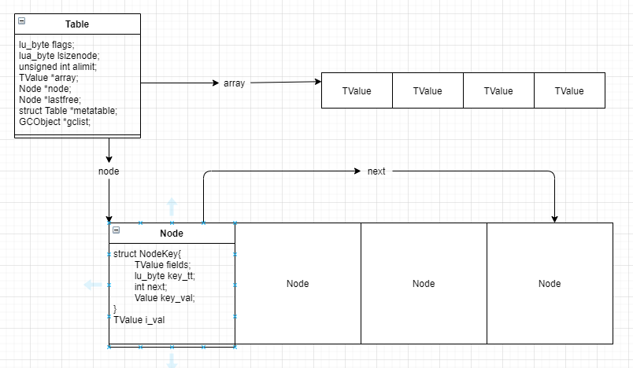

# Table

## 要点
1. Lua Table 有两部分组成：有序列表array和hashtable：  
   - (a). array是一个动态维护的数组，key就是数组的索引，从1开始到size；数组大小由个数决定，在2的幂次情形下动态增长。  
   - (b). hashtable也是一个动态维护的数组，索引是hash(key)，使用链接法解决hash冲突。 

2. Lua Table根据key找value的时候，对于key是int类型的情况会先去array里找，如果找不到再去hash table里找。
3. 新增key或者是GC的时候才会触发resize，resize会统计当前int为key的数目，根据利用率>=50%来确定array的大小，余下的int key的键值对仍然放入hash table中。
4. hash table使用数组实现，用链接法解决hash冲突，新加键值对的时候需要注意维护好链接关系。
5. Lua Table对int, short str都有直接的get函数来加快查找，否则使用通用的get。

## 数据结构
                #define CommonHeader	struct GCObject *next; lu_byte tt; lu_byte marked

                /*
                ** Nodes for Hash tables: A pack of two TValue's (key-value pairs)
                ** plus a 'next' field to link colliding entries. The distribution
                ** of the key's fields ('key_tt' and 'key_val') not forming a proper
                ** 'TValue' allows for a smaller size for 'Node' both in 4-byte
                ** and 8-byte alignments.
                */
                typedef union Node {
                        struct NodeKey {
                                TValuefields;  /* fields for value */
                                lu_byte key_tt;  /* key type */
                                int next;  /* for chaining */
                                Value key_val;  /* key value */
                        } u;
                        TValue i_val;  /* direct access to node's value as a proper 'TValue' */
                } Node;

                typedef struct Table {
                        CommonHeader;
                        lu_byte flags;  /* 1<
具体hash计算方式详见mainpositionTV函数|
|static Node *mainpositionfromnode|根据节点获取主节点|const Table *t, Node *nd|先获取Node的key，再调用mainpositionTV获取主节点|
|static int equalkey|比较key和node的key是否相同|const TValue *k1, const Node *n2, int deadok|1. raw compare, no metamethods 2. defalut case是比较pointer identity(short string, dead keys等也是)|
|luaH_realasize|返回array实际的大小|const Table *t||
|getgeneric|获得指定key的Node的值|Table *t, const TValue *key, int deadok||
|arrayindex|判断并返回有效的array部分的索引，没有则返回0|lua_Integer||
|findindex|查找一个key所在的索引|lua_State *L, Table *t, TValue *key, unsigned int asize|分array part和hash part查找并返回|
|luaH_next|根据当前key，找到下一个有效的key，并设置到StkId中|lua_State *L, Table *t, StkId key|用于迭代table所有有效的key value|
|freehash|释放hash part|lua_State *L, Table *t|无|
|computesizes|用于rehash: 计算合适的array大小|unsigned int nums[], unsigned int *pna|根据当前的keys（所有整数key，包括array和hashtable中的）重新计算array真正所需大小（有些值被置nil了），合适的大小为：最大的且利用率>=50%的2次幂作为新的size。其余的值分放到hashtable中。|
|countint|计算array中，key的分布|lua_Integer key, unsigned int *nums|nums是一个数组，nums[i]表示(2 ^ (i - 1)，2 ^ i]区间的key的个数|
|numusearray|num use array，统计array中的有效值|const Table *t, unsigned int *nums|array的size是2的幂次，根据 (, 1], (1, 2], (3, 4], (5, 8], (9, 16].... 的分片形式，统计每个分片里的有效值个数和所有有效值个数|
|numusehash|统计hash part有效值个数，并处理key是整型可以放入array part的相关数据|const Table *t, unsigned int *nums, unsigned int *pna||
|setnodevector|根据大小创建一个新的hash table用的Node数组|lua_State *L, Table *t, unsigned int size|1. size 0则置t->node为dummynode 2. t->node指向数组第一个元素 3. t->lastfree指向数组最后一个Node（反向使用）|
|reinsert|将旧的hash part的值重新插入到新的hash part|lua_State *L, Table *ot, Table *t|遍历有效值，luaH_set到新的table|
|exchangehashpart|exchange hash part|Table *t1, Table *t2|node root, lastfree node, lsizenode三部分的exchange|
|luaH_resize|根据指定大小resize table，包括了array part和hash part|lua_State *L, Table *t, unsigned int newasize, unsigned int nhsize|分配内存时有可能会失败，tricky的方式处理了array shrinking的情形如下： 1. 将old table的alimit设置为new size(小于old size)，exchange了hash part 2. 遍历(newsize，oldsize)之间的索引（对于old table来说是在array part的，但是shrink后是处于new table的hash part的）将array中的值移入hash part 3. 再次exchange hash part，并将old table的alimit设置回old size。  步骤2中的遍历设置操作因为步骤1交换了hashpart，故就是old table内部的操作，随后经过步骤3的exchange回来，此时old table啥也没改动到，而new table中的hash part已经有shrink掉的array数据了|
|luaH_resizearray|根据t->lsizenode算得当前的node size并调用luaH_resize|lua_State *L, Table *t, unsigned int nasize|lsizenode保存了log2的node array的size|
|rehash|重新计算array part和hash part所需大小并调用luaH_resize调整|lua_State *L, Table *t, const TValue *ek|见[computesizes](#1)|
|Tabel *luaH_new|创建一个新的table|lua_State *L|创建一个GCObject，cast to Table，然后初始化|
|luaH_free|free table|lua_State *L, Table *t|free hash, free array, free table|
|getfreepos|获取可用的Node节点|Table *t|t->lastfree--遍历，找到第一个key为nil的位置|
|luaH_newkey|插入一个新的key到hash table|lua_State *L, Table *t, const TValue *key, TValue *value|1. hash key找到main position，Node上没值则直接置入 2. 如果冲突位置的Node有值了，找到Node上key的main position，然后分3，4两种情况处理 3. 冲突Node上的key的main positon和当前的要插入的key的main position是一样的，此时把值置入从freelist上拿到的Node（拿不到会触发一次rehash),然后串到main position上的链的第一个位置。 4. 如果冲突Node的main position和要插入的不一致，则从main position开始往下找到冲突Node的上一个Node，随后将冲突Node置入free node并维护好链，后续就直接将新Node置入main position即可。|
|luaH_getint|获取指定integer的key的值|Table *t, lua_Integer key|key < t->alimit的时候直接从array part拿，否则尝试一下到alimit + 1的位置拿，再否则尝试到hashtable里拿|
|luaH_getshortstr|获取指定short string的key的值|Table *t, TString *key|直接尝试到hash part拿|
|luaH_getstr|获取指定string的key的值|Table *t, TString *key|short string则luaH_getshortstr，否则getgeneric使用通用的查找方式|
|luaH_get|主要的方式|Table *t, TValue *key|根据key的类型调用luaH_getshortstr, luaH_getint等，默认使用getgeneric方式|
|luaH_finishset|set value into a slot|lua_State *L, Table *t, const TValue *key, const TValue *slot, TValue *value|如果slot不存在，调用luaH_newkey新增一个slot|
|luaH_set|set key value into table|lua_State *L, Table *t, const TValue *key, TValue *value|先调用luaH_get找到slot，在调用luaH_finisheset把值设置进slot|
|luaH_setint|set一个整型key到table中|lua_State *L, Table *t, lua_Integer key, TValue *value|通过luaH_getint找到要设置的TValue位置，可能在array part也可能在hash part，如果找不到luaH_newkey，否则直接set即可|
|static lua_Unsigned hash_search||Table *t, lua_Unsigned j||
|static unsigned int binsearch||const TValue *array, unsigned int i, unsigned int j||
|lua_Unsigned luaH_getn|计算table的boundary|Table *t| Try to find a boundary in table 't'. (A 'boundary' is an integer index such that t[i] is present and t[i+1] is absent, or 0 if t[1] is absent and 'maxinteger' if t[maxinteger] is present.)|
---

 

 

图2.1 table结构理解图 

## 思考

- 1. real size是啥，alimit是啥  
- 2. luaH_getn怎么算的  